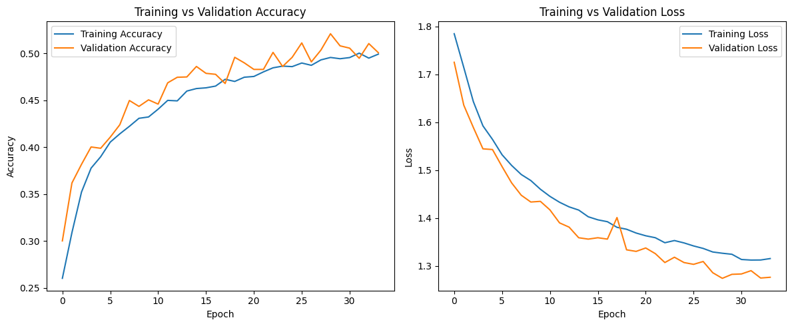
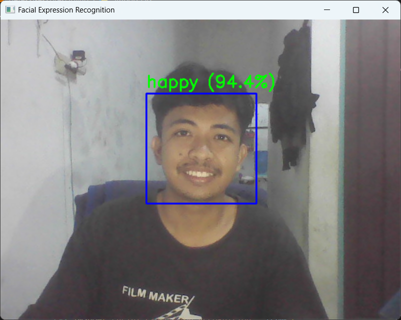

# Facial Expression Recognition (FER2013)

Proyek ini bertujuan untuk membangun model pengenalan ekspresi wajah menggunakan Convolutional Neural Network (CNN) dengan dataset FER2013 dan implementasi real-time menggunakan OpenCV.

## 👥 Kelompok 5 - Kecerdasan Buatan

| Status   | Name                | NIM           | University          | Media                                                                       | GitHub                                        |
| -------- | ------------------- | ------------- | ------------------- | --------------------------------------------------------------------------- | --------------------------------------------- |
| `Active` | Riyan Fazri Rahman  | `C2255201005` | STMIK Palangka Raya | [LinkedIn](https://www.linkedin.com/in/riyan-fazri-rahman/)                 | [GitHub](https://github.com/riyanfazrirahman) |
| `Active` | Alif Rahmatullah L. | `C2255201029` | STMIK Palangka Raya | [LinkedIn](https://www.linkedin.com/in/alif-rahmatullah-lesmana-565028311/) | [GitHub](https://github.com/Peparrepair)      |
| `Active` | Rif'ad Amin Jayadi  | `C2255201018` | STMIK Palangka Raya | -                                                                           | [GitHub](https://github.com/)                 |
| `Active` | Oga Luisca MIka S.  | `C2255201016` | STMIK Palangka Raya | -                                                                           | [GitHub](https://github.com/)                 |

---

## 📦 Dataset

Dataset: [FER2013 (Kaggle)](https://www.kaggle.com/datasets/msambare/fer2013)

## 📂 Struktur Proyek

```sh
facial-expression-recognition/
├── 📂 fer2013/             # Folder dataset
│   ├── 📂train/
│   │   ├── 📂angry/
│   │   ├── 📂disgust/
│   │   ├── 📂fear/
│   │   ├── 📂happy/
│   │   ├── 📂neutral/
│   │   ├── 📂sad/
│   │   └── 📂surprise/
│   └── 📂test/
│       └── 📂...
├── training-ekpresi.ipynb  # File untuk training model
├── deteksi-ekpresi.ipynb   # Deteksi ekspresi via webcam
└── expression_model.keras  # Model hasil pelatihan
└── labels.json             # Data lebel
```

## 🧠 Model Arsitektur

- Input: Gambar grayscale 48x48
- Conv2D + ReLU + MaxPooling (x2)
- Flatten
- Dense + Dropout
- Output: 7 kelas emosi (softmax)

Model dikompilasi dengan:

- Optimizer: Adam
- Loss: Categorical Crossentropy
- Metric: Accuracy

## 📊 Hasil Pelatihan

Model dilatih selama 50 epoch dengan `EarlyStopping` dan `validation_split` 10%.  
Visualisasi hasil:

- Training vs Validation Accuracy
- Training vs Validation Loss



Model disimpan ke file: `expression_model.keras`

## 🎥 Real-Time Deteksi Ekspresi

Menggunakan OpenCV + Haar Cascade untuk deteksi wajah dan CNN untuk klasifikasi ekspresi.
Output webcam menampilkan:

- Ekspresi wajah (contoh: happy)
- Confidence (contoh: 94.4%)

Contoh tampilan webcam:

